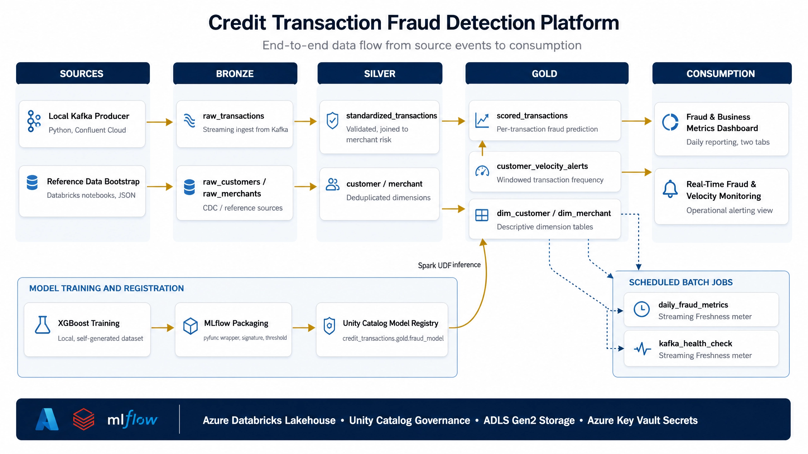
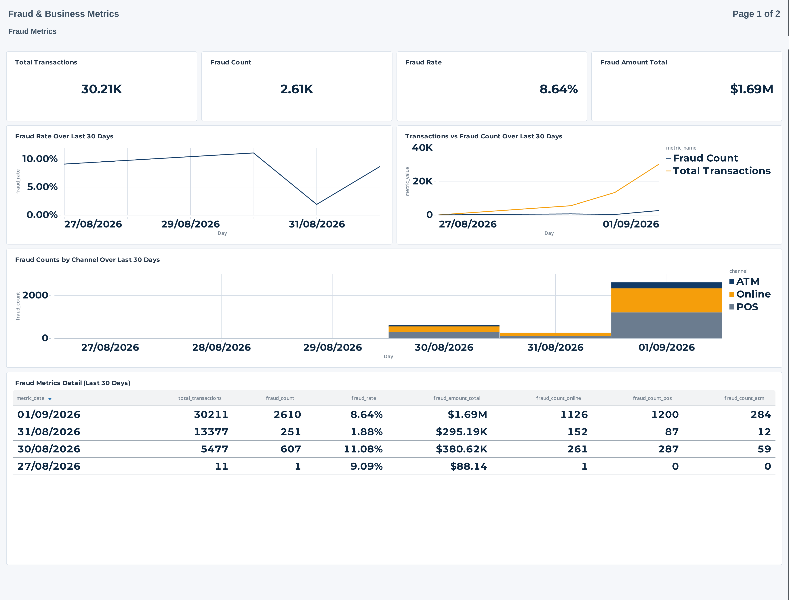
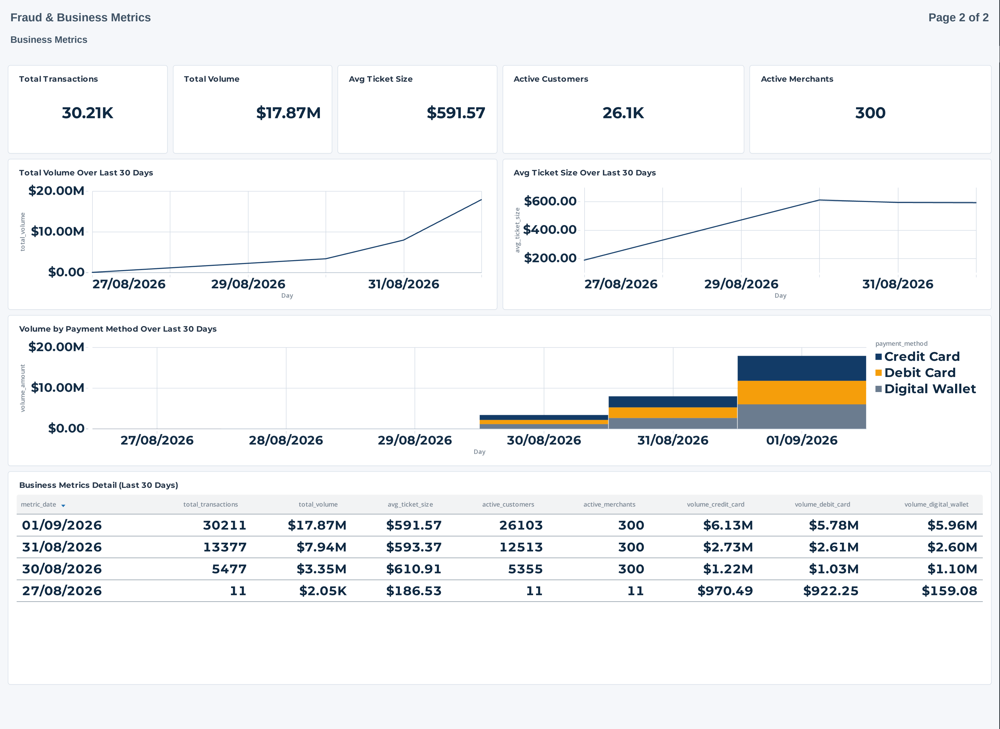
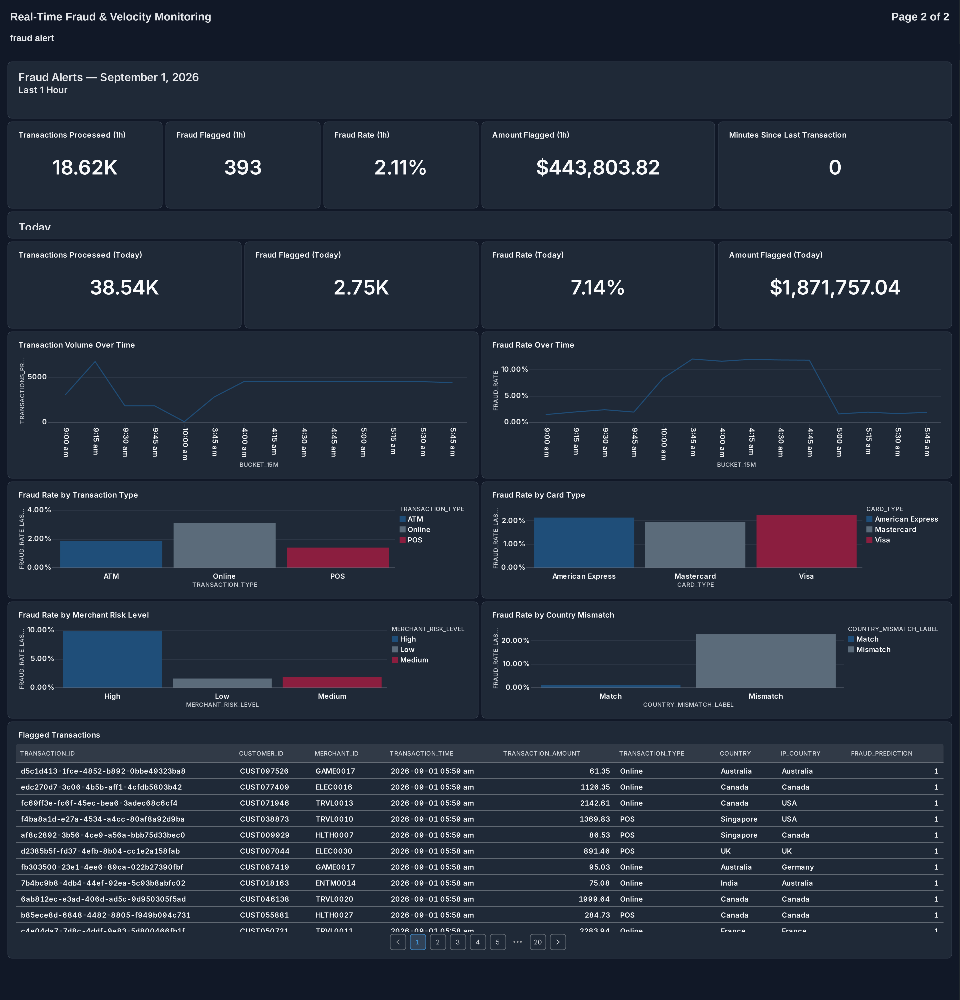

# Credit Transaction Fraud Detection Platform

This project implements a complete data engineering platform for detecting fraudulent credit card transactions. It covers the full path from event generation through streaming ingestion, a layered lakehouse architecture, model training and registration, scheduled aggregation, operational monitoring, and reporting. The platform is built on Azure Databricks with Unity Catalog governance and Delta Lake storage, and the transaction stream is produced independently through Confluent Cloud Kafka.

The purpose of the project is to demonstrate the design and construction of a production style fraud detection system, including the reasoning behind each architectural decision rather than only the resulting code.

## Architecture



Transactions are generated by a local Python producer and published to a Kafka topic on Confluent Cloud. Reference data for customers and merchants is generated once and bootstrapped from local storage. Inside Databricks, three Lakeflow Declarative Pipelines maintain the lakehouse: one for the transaction stream, one for the customer dimension, and one for the merchant dimension. Each pipeline follows the medallion pattern.

The bronze layer holds raw, unmodified records as they arrive. The silver layer validates and standardizes those records, applying row level data quality expectations and joining transactions to merchant risk classification. The gold layer produces consumption ready tables, including per transaction fraud predictions, windowed velocity alerts for individual customers, and descriptive dimension tables for reporting.

A fraud classification model is trained locally using XGBoost on a generated training set with a three way split between training, validation and test data. The trained model is wrapped as an MLflow pyfunc model, given an explicit signature and input example, and registered in the Unity Catalog model registry. The gold layer pipeline loads this registered model through a Spark user defined function and scores every transaction as it arrives.

Two scheduled Databricks Jobs run outside the streaming pipeline. One computes daily fraud and business metrics through an idempotent merge against the gold layer, bounded to a rolling reconciliation window. The other checks the freshness of the scored transaction table on a fixed interval and raises an alert by email if no new data has landed within the configured threshold, which allows a silent stall in the streaming pipeline to be caught even though it produces no outright failure.

The infrastructure for these jobs and pipelines is also captured as a Databricks Asset Bundle, expressed in YAML and validated against the live workspace resources. This allows the platform configuration to be reviewed and versioned alongside the application code, in addition to being managed through the Databricks UI.

## Dashboards and analysis

Two Databricks Lakeview dashboards were built on top of the gold layer. The first reports daily fraud and business metrics across two tabs. The second is an operational view intended for near real time monitoring of fraud activity and transaction velocity.

### Fraud and business metrics





Transaction volume grew steadily over the observed period as the producer throughput increased, rising from a small initial test run to over thirty thousand transactions in the most recent day, with total volume reaching approximately eighteen million dollars. The count of active customers tracks closely with total transaction volume each day, which indicates that activity is broadly distributed across the customer base rather than concentrated among a small number of repeat customers. Average ticket size remained stable at roughly five hundred and ninety dollars across the period, consistent with the fixed pricing ranges configured per merchant category, and spending is split close to evenly across credit card, debit card and digital wallet.

The daily fraud rate ranged between two and eleven percent across the observed days. This volatility is expected given the size of each daily sample and the behaviour of the classifier, rather than an indication of a fault in the pipeline.

### Real time fraud and velocity monitoring



The breakdown panels on this dashboard identify which fields carry the strongest fraud signal. The clearest and most consistent separation appears between transactions where the IP address country matches the billing country and those where it does not, with the mismatched group showing a fraud rate many times higher than the matched group. Merchant risk classification shows a similar pattern, with high risk merchants producing a materially higher flagged rate than medium or low risk merchants. Transaction channel and card type show comparatively modest differentiation, suggesting these fields act as weaker, secondary signals relative to geographic mismatch and merchant risk tier.

The reported fraud rate should be read as the proportion of transactions the model flags for review at its configured decision threshold, not as a confirmed rate of fraud. The threshold was deliberately set to favour recall, so the model is expected to flag a meaningful share of legitimate transactions alongside genuine fraud. Precision at this threshold is limited, which is a function of how separable the generated training labels are from the available features rather than an implementation defect. Flagged transactions are best treated as candidates for review rather than confirmed outcomes.

## Technology stack

| Layer | Technology |
| --- | --- |
| Event streaming | Python, Confluent Cloud Kafka |
| Lakehouse platform | Azure Databricks, Lakeflow Declarative Pipelines |
| Storage and governance | Delta Lake, Unity Catalog, Azure Data Lake Storage Gen2 |
| Secrets management | Azure Key Vault |
| Machine learning | XGBoost, scikit learn, SHAP, MLflow |
| Orchestration | Databricks Jobs, Databricks Asset Bundles |
| Reporting | Databricks Lakeview Dashboards |
| Package management | uv |

## Repository layout

```
src/credit_transaction_fraud_process/
  kafka/            local Kafka producer and reference data generation
  fraud_model/       model training, evaluation and MLflow packaging
  credit_trans/       pipeline notebooks synced from Databricks Repos
databricks.yml        Databricks Asset Bundle definition
resources/             job and pipeline resources for the bundle
images/                architecture diagram and dashboard exports
```
